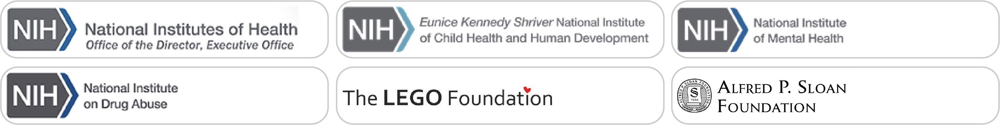

<div style="text-align:right">
<div class="videobuttons">
<button size="xs" type="button" data-toggle="collapse" data-target="#parents-english">
[English](index.html)
</button>
</div>
</div>
## Un estudio de lo que hacen los bebes diariamente en su hogar

<!-- <br> -->

<video width="100%" controls>
  <source src="img/PLAY-parents-noaudio.mp4" type="video/mp4">
</video>

<div class="img1000">    
<br><br>
¡Somos investigadores universitarios conduciendo el primer estudio en gran escala sobre lo que los bebes hacen en su hogar! Estamos invitando a participar en este innovador estudio a mil familias con bebes (de hasta 2 años de edad) a través de Norte América. Investigadores expertos visitarán su hogar y grabarán un pedacito de su vida diaria. Usted ayudará a que los científicos entiendan de mejor manera como los niños aprenden en su hogar.
</div>
    
<br>

### Que pueden esperar las familias

<div class="img1000">
- <p>Una visita a su hogar por un investigador (2-3 horas de duración)</p>
- <p>Usted y su hijo/a realizaran sus actividades rutinarias</p>
- <p>El investigador le hará algunas preguntas sobre su casa, hijo/a, y familia</p>
- <p>El investigador grabará toda la visita en video
- <p>Los videos se colocarán en una video biblioteca segura a la cual solo otros investigadores tendrán acceso
- <p>**Usted recibirá una tarjeta de regalo valorada en $50 por su participación.**</p>

</div>
<div class="img1000">
<p-small>*Su participación y la de su hijo/a es voluntaria y usted puede elegir terminar una sesión en cualquier momento sin pérdida de beneficios. Usted tiene derecho a revisar los videos u otros archivos de la visita a su hogar y puede solicitar que todo o parte de los datos sean destruidos. Usted tiene derecho a omitir cualquier pregunta que no quiera responder. No hay riesgos conocidos asociados con la participación de su hijo/a en este estudio más allá de los de la vida cotidiana.*</p-small>
</div>

<br>

### Regístrese y sea parte de algo grande

<div class="img1000">    
¡Nos encantaría que usted y su hijo/a participen! Si está interesado/a, por favor busque la universidad más cercana a usted e inscríbase usando el formulario debajo del mapa.
</div>

```{r child = 'parent-form-spanish.Rmd'}
```

### Apoyo

<div class="img1000"> 
Este proyecto tiene apoyo vía fondos otorgados por la Oficina del Director, Institutos Nacionales de Salud (NIH), Instituto Nacional de Salud Infantil y Desarrollo Humano Eunice Kennedy Shriver (NICHD), Instituto Nacional de Salud Mental (NIMH), y el Instituto Nacional sobre el Abuso de Drogas bajo R01HD094830-01, LEGO Foundation, y la Fundacion Alfred P. Sloan.
</div>



