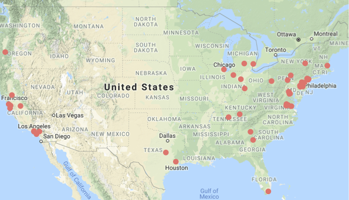

 

# An hour in the life...

### A study that looks at how mothers and children 
### behave in their natural home environments.

 

    
Researchers across 30 universities in North America are coming together to learn about what mothers and children do at home. Experienced researchers will visit the homes of participating families and record a slice of the daily lives of mothers and children. Participating families may help scientists to better understand how children learn in the home.

    
 

### Eligibility for participation

    
You and your child will be eligible to participate in this study if all six of these are true:

1. Your child is the only child in the home (i.e. has no siblings)
2. Only English and/or Spanish is/are spoken at home
3. Your child was born at term (37-41 weeks)
4. Your child has not been diagnosed with any disability (cognitive, auditory, vision, motor)
5. Both biological parents of the child were at least 21 when the child was concieved.
6. You are willing to share the video recordings with other researchers (through a secure web-based library available only to accredited researchers)

 

### What you can expect

    
This single-session study will last between 120 and 180 minutes. If you agree to be in this study, we will ask you and your child to go about your daily activities for an hour in your home while we film you. We will also film the rooms in your home, measure the spaces that are accessible to your child, and record the decibel level of ambient noise in your home. We may ask you and your child to play with a set of child-friendly toys for a few minutes. Finally, we may ask you questions about your child’s locomotion, language, emotion, health, toys and animals and media use in the home, and racial and ethnic background as well questions about family health, division of household labor, and education. 

_**You will receive a \$50 gift card for your participation.**_

Your and your child’s participation are voluntary and you can choose to end a session at any time without loss of benefits. You have the right to review videos and other records of your home visit session and request that all or any portion of the data be destroyed. You have the right to skip any questions you do not wish to answer. There are no known risks associated with your child’s participation in this research beyond those of everyday life.

 

### Sign up and be a part of something big

    
We would love for you and your child to participate! If you are interested, and if you are elgible to participate, please sign up using the form below.

<form action="/action_page.php">
  First name: &emsp; &emsp; &emsp; &emsp; &emsp; &emsp; &emsp; &emsp; Last name:  &emsp; &emsp; &emsp; &emsp; &emsp; &emsp; &emsp; &emsp; email  
  <input type="text" name="firstname" value=""> &emsp; &emsp; <input type="text" name="lastname" value="">&emsp; &emsp;   <input type="text" name="email" value="">   
<fieldset>
<!--   <label for="univ">These are the universities</label>
			<textarea id="univ" name="univ"> This becomes </textarea>
-->
   <label for="state">Choose the state you live in</label>
			<select id="state" name="state">
			<option value="SelectState">--Select State--</option>
			<option onclick="CA()" value="California">California</option>
			<option onclick="document.getElementById('univ').innerText = Boos" value="District of Columbia">District of Columbia</option>
			<option value="Florida">Florida</option>
			<option value="Georgia">Georgia</option>
			<option value="Illinois">Illinois</option>
			<option value="Indiana">Indiana</option>
			<option value="Louisiana">Louisiana</option>
			<option value="Maine">Maine</option>
			<option value="Michigan">Michigan</option>
			<option value="New Jersey">New Jersey</option>
			<option value="New York">New York</option>
			<option value="Ohio">Ohio</option>
			<option value="Oregon">Oregon</option>
			<option value="Pennsylvania">Pennsylvania</option>
			<option value="Tennessee">Tennessee</option>
			<option value="Texas">Texas</option>
			<option value="Virginia">Virginia</option>
			</select>
   </fieldset>
 <input type="submit" value="Submit">

</form>
  

<!--
<form class="search-form" id="search-form" method="post" accept-charset="UTF-8" action="/search/user">
<fieldset>
   <label for="state">Choose the state you live in</label>
			<select id="state" name="state">
			<option value="---">---</option>
-->

<!--
$("#state").change(function() {
  var action = $(this).val() == "California" ? "user" : "content";
  $("#search-form").attr("action", "/search/" + action);
});

# Sample form

<form class="search-form" id="search-form" method="post" accept-charset="UTF-8" action="/search/user">
  <select id="selectsearch" class="form-select" name="selectsearch">
    <option value="people">Search people</option>
    <option value="node">Search content</option>
  </select>
  <label>Enter your keywords: </label>
    <input type="text" class="form-text" value="" size="40" id="edit-keys" name="keys" maxlength="255" />
    <input type="submit" class="form-submit" value="Search" id="edit-submit" name="search"/>
</form>

$("#selectsearch").change(function() {
  var action = $(this).val() == "people" ? "user" : "content";
  $("#search-form").attr("action", "/search/" + action);
});
-->

### List of universities where you can participate

 

##### California
* California State University at Fullerton    
* California State University at Long Beach
* Stanford University
* University of California at Davis
* University of California at Merced
* University of California at Riverside
* University of California at Santa Cruz

##### District of Columbia
* Georgetown University

##### Florida
* University of Miami

##### Georgia
* University of Georgia

##### Illinois
* University of Chicago
* University of Chicago

##### Indiana
* Indiana University
* Purdue University

##### Louisiana
* Tulane University

##### Massachusetts
* Boston University

##### Michigan
* Michigan State University

##### New Jersey
* Princeton University
* Rutgers University

##### New York
* City University of New York, College of Staten Island
* Cornell University
* New York University

##### Ohio
* Ohio State University

##### Oregon
* University of Oregon

##### Pennsylvania
* Children's Hospital of Philadelphia
* Penn State University
* University of Pittsburgh

##### Tennessee
* Vanderbilt University

##### Texas
* University of Houston
* University of Texas at Austin

##### Virginia
* Virginia Commonwealth University

